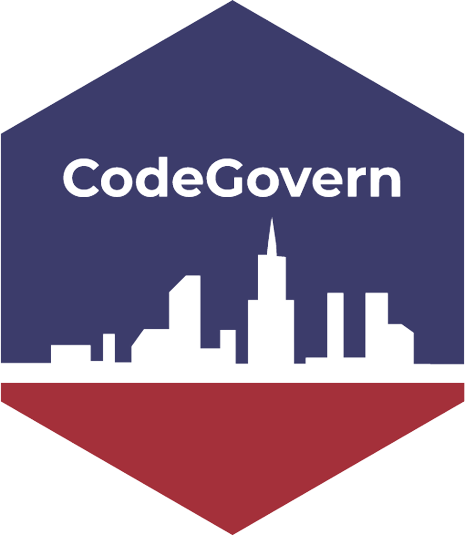

<!-- README.md is generated from README.Rmd. Please edit that file -->

```{r, include = FALSE}
knitr::opts_chunk$set(
  collapse = TRUE,
  comment = "#>",
  fig.path = "man/figures/README-",
  out.width = "100%"
)
```

# CodeGovern 

<!-- badges: start -->
[](https://lifecycle.r-lib.org/articles/stages.html#experimental)
[](https://CRAN.R-project.org/package=CodeGovern)
[](https://github.com/abeltranandrade/CodeGovern/actions/workflows/R-CMD-check.yaml)
<!-- badges: end -->

### Purpose
Code Govern is a package used to scrape, import, and download datasets and metadata from the website [Data.gov](https://data.gov/). This website is the federal government's open data site, and has over 298,424 datasets available to download in various export types (i.e., .csv, .xml, .json). Using **CodeGovern** functions, the data can be easily downloaded onto your computer, or for .csv files, return the data directly in RStudio. The user can also view the list of available datasets and get an alert if the data is federal or non-federal. Our functions currently support the download of CSV, JSON, and XML file types.  

### Target audience
This package is intended for users who want to work with the open government data without having to repetitively download data and prefer not to work with the [Data.gov](https://data.gov/) interface. This package is also useful for those with domain knowledge who want to start working with data but want a more seamless experience given their limited experience.


### Installation

You can install the development version of **CodeGovern** as follows:

``` r
devtools::install_github("abeltranandrade/CodeGovern")
```
You can also clone the repository and install it through the Rstudio build panel. 

### Functions Included

The following functions allow the user to scrape and download data, explore available datasets on the website, and view if the data of interest is of federal or non-federal origin.

- `get_gov_file` downloads and imports a single dataset of type CVS, JSON, and XML

- `get_many_gov_files` downloads multiple datasets of type CSV and returns a list of data frames

- `explore_datasets` gives the names of the datasets available on the [Data.gov](https://data.gov/) website.

- `federal_alert` alerts user if data is Non-Federal


### Usage

These are a few examples of how to use the package to scrape data from [Data.gov](https://data.gov/).

Load `CodeGovern` R package:

```{r}
library(CodeGovern)
```

1. Download [Electric Vehicle Population Data](https://catalog.data.gov/dataset/electric-vehicle-population-data) in JSON format and [Lottery Powerball Winning Numbers Beginning 2010](https://catalog.data.gov/dataset/lottery-powerball-winning-numbers-beginning-2010) in CSV format.

```{r eval = FALSE}
#download the data set locally
get_gov_file("Electric Vehicle Population Data", "json") 

#download the data set locally and import it to the environment
my_data2 <-get_gov_file("Lottery Powerball Winning Numbers Beginning 2010", "csv") 
```

2. Download [FDIC Failed Bank List](https://catalog.data.gov/dataset/fdic-failed-bank-list) and [Demographic Statistics By Zip Code](https://catalog.data.gov/dataset/demographic-statistics-by-zip-code) datasets in CSV format simultaneously.
```{r eval=FALSE}
#Create a list of dataset names
my_names <- c("FDIC Failed Bank List", "Demographic Statistics By Zip Code")

#Download the datasets and import them in the environment
my_datasets <- get_many_gov_files(my_names, import = TRUE)
```

3. View whether the data of interest is a federal or non-federal origin.

```{r}

```

4. View the available datasets

### Contributors

- [Lika Mikhelashvili](https://github.com/lmikhelashvili)

- [Vibha Gogu](https://github.com/vibhagogu)

- [Adriana Beltran Andrade](https://github.com/abeltranandrade)
